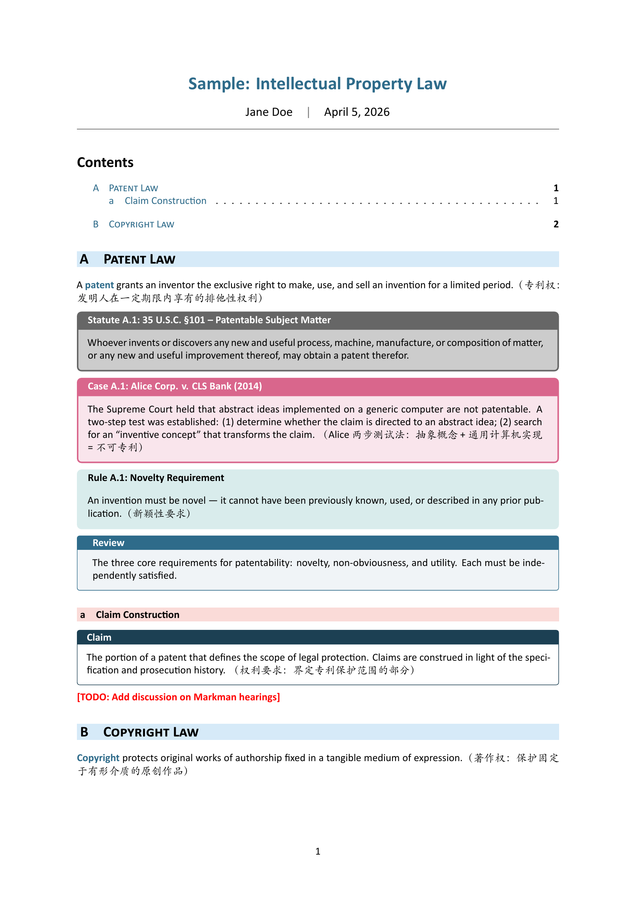
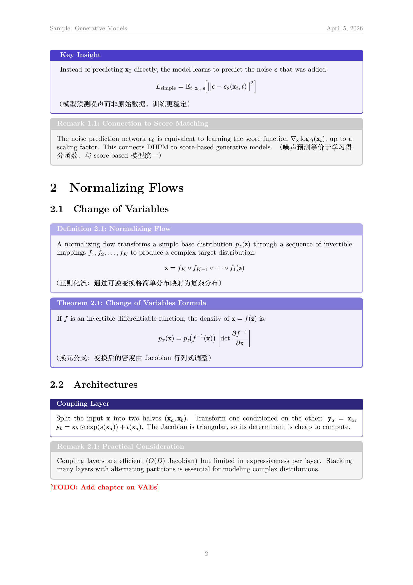

# lexnote

Personal LaTeX note class for `ctexart` / `ctexrep` / `ctexbook`.

## Install

```bash
./setup.sh
```

This copies `lexnote.cls` to your `TEXMFHOME` so it's available globally.

## Usage

```latex
\documentclass{lexnote}               % ctexart + law (default)
\documentclass[style=ml]{lexnote}     % ctexart + ML
\documentclass[rep]{lexnote}          % ctexrep + law
\documentclass[book]{lexnote}         % ctexbook + law
\documentclass[book,style=ml]{lexnote}% ctexbook + ML
```

## Styles

| Style | Fonts | Colors | Environments |
|-------|-------|--------|-------------|
| `law` (default) | Calibri + Kaiti SC | Teal | `statute`, `case`, `rul` |
| `ml` | Computer Modern + Songti SC (bold: Noto Sans CJK, italic: Kaiti) | Purple-blue | `thm`, `lem`, `defn`, `rem` |

Both styles include: `notebox`, `defbox`, `\keyword{}`, `\todo{}`.

### Law style



### ML style




## Requirements

- TeX Live / MacTeX with XeLaTeX
- CTeX bundle
- **ML style** requires Noto Sans CJK SC for CJK bold:

  ```bash
  brew install --cask font-noto-sans-cjk-sc
  ```
